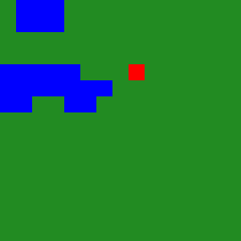

# Stochastic Forest Fire Model (Cellular Automaton)

Simulation of wildfire propagation using a two-dimensional stochastic cellular automaton with environmental dynamics.

---

## Overview

This project implements a probabilistic spatial model of wildfire spread.  
The simulation is based on a 2D cellular automaton with dynamic state transitions and environmental modifiers.

The model continues until no burning trees remain.

---

## Example Simulation



---

## Model Description

Each cell can be in one of four states:

-  Tree
-  Burning tree
-  Burned tree
-  Water (barrier)

At each generation:

1. Burning trees ignite neighboring trees with probability `p`.
2. Wind modifies ignition probability depending on direction and strength.
3. Burning trees transition to burned state.
4. Burned trees regenerate after `k` generations.
5. The simulation ends when no burning trees remain.

---

## Default Parameters

| Parameter | Value |
|------------|--------|
| Map size | 15 × 15 |
| Initial burning trees | 1 |
| Water percentage | 10% |
| Ignition probability (p) | 0.3 |
| Regrowth delay (k) | 3 generations |
| Wind direction | NO |
| Wind strength modifier | 2 |
| Random ignition | 0 |

---

## Key Concepts Demonstrated

- Cellular automata modeling
- Stochastic state transitions
- Environmental parameter influence (wind dynamics)
- Spatial propagation modeling
- Iterative simulation systems

---

## Technologies

- Python
- NumPy
- Pillow (PIL)

---

## Running the Simulation

```bash
pip install -r requirements.txt
python src/simulation.py
```
The generated animation will be saved as:
```
examples/simulation.gif
```
Author:
Paweł Leszczyński
